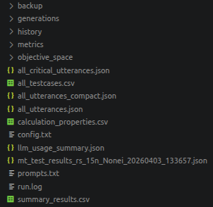

<h1 align="center">🌙 LUNAR: Automated Testing of Multi-Turn Conversations in Task-Oriented LLM Systems
</h1>

## Project Structure

The high-level project overview is as follows:

```text
|-- sensei        # Baseline
|-- convqa        # Open-source chatbot
|-- lunar/        # Test approach
    |-- run_mt_navi.py
    |-- run_mt_car_control.py
    |-- opensbt/
    |-- llm
    |-- configs
    |-- judge_eval_mt
        |-- evaluate_agreement_users.py
        |-- evaluate_judge_humans_major.py
```
---

## Installation
To run the LUNAR code, you first need to install the dependencies. After installing Python 3.11, create a virtual environment and install dependencies with:

```bash
python3.11 -m venv venv && pip install -r requirements.txt
```

LUNAR requires model access to OpenAI LLMs. Configure the endpoints and API key in `.env`.

LUNAR integrates with the CarQA chatbot. Similarly, create a virtual environment and install its dependencies in `carqa`.

To enable comparison with the SENSEI baseline, install SENSEI similarly.

To verify that installation is successful, run the test-wise execution where the test bot is mocked with an LLM (OpenAI):

```bash
bash run_mt_carcontrol_test_openai.sh
```

A results folder should be generated with a structure as follows:



## Configuration

Lunar integrates two case studies:

- POI Search/Navigation: Search for venues which meet constraints, e.g., restaurants, bars
- Car Control: Control of car features such as windows, fan, seat heating

### Navi

To test the chatbot for Navi, first deploy the CarQA chatbot in a separate terminal. In `.env`, set `NO_NLU=POI`.

You can then run a randomized search experiment with the following command:

```bash
python run_mt_navi.py \
      --algorithm rs \
      --n 15 \
      --sut ipa_yelp \
      --llm_ipa gpt-5-chat \
      --llm_intent_classifier DeepSeek-V3-0324 \
      --llm_judge gpt-5-mini \
      --llm_generator DeepSeek-V3-0324 \
      --features_config configs/features_simple_judge_navi.json \
      --max_time "00:05:00" \
      --store_turns_details \
      --seed 1 \
      --weight_clarity 0.35 \
      --weight_request_orientedness 0.65 \
      --th_dims 0.65 \
      --th_efficiency 0.65 \
      --th_effectiveness 0.75 \
      --save_folder "/results" \
      --no_wandb
```
To run a genetic algorithm based search use:

```bash
python run_mt_navi.py \
      --algorithm nsga2 \
      --n 15 \
      --sut ipa_yelp \
      --llm_ipa gpt-4o \
      --llm_intent_classifier DeepSeek-V3-0324  \
      --llm_judge gpt-5-mini \
      --llm_generator DeepSeek-V3-0324  \
      --features_config configs/features_simple_judge_navi.json \
      --max_time "03:00:00" \
      --wandb_project "CarControlYELP" \
      --store_turns_details \
      --seed 1 \
      --weight_clarity 0.35 \
      --weight_request_orientedness 0.65 \
      --th_dims 0.65 \
      --th_efficiency 0.65 \
      --th_effectiveness 0.75 \
      --save_folder "/results" \
      --no_wandb
```
To run the baseline SENSEI use the corresponding scripts available in the SENSEI folder.

### Car Control

To run LUNAR for the Car Control case study, switch CarQA to CAR mode in the `.env` file.

Then you can run LUNAR as follows:

```bash
python run_mt_car_control.py \
      --algorithm rs \
      --n 15 \
      --sut ipa_yelp \
      --llm_ipa gpt-5-chat \
      --llm_intent_classifier DeepSeek-V3-0324 \
      --llm_judge gpt-5-mini \
      --llm_generator DeepSeek-V3-0324 \
      --features_config configs/features_simple_judge_cc.json \
      --max_time "00:05:00" \
      --store_turns_details \
      --seed 1 \
      --weight_clarity 0.35 \
      --weight_request_orientedness 0.65 \
      --th_dims 0.65 \
      --th_efficiency 0.65 \
      --th_effectiveness 0.75 \
      --save_folder "/results" \
      --no_wandb
```
To run a genetic algorithm based search use:

```bash
python run_mt_car_control.py \
      --algorithm nsga2 \
      --n 15 \
      --sut ipa_yelp \
      --llm_ipa gpt-4o \
      --llm_intent_classifier DeepSeek-V3-0324  \
      --llm_judge gpt-5-mini \
      --llm_generator DeepSeek-V3-0324  \
      --features_config configs/features_simple_judge_navi.json \
      --max_time "03:00:00" \
      --wandb_project "CarControlYELP" \
      --store_turns_details \
      --seed 1 \
      --weight_clarity 0.35 \
      --weight_request_orientedness 0.65 \
      --th_dims 0.65 \
      --th_efficiency 0.65 \
      --th_effectiveness 0.75 \
      --save_folder "/results" \
      --no_wandb
```
To run the baseline SENSEI for car control use the corresponding scripts available in the SENSEI folder.

## Replication

## RQ1 (Judge evaluation)

To evaluate judges for conversation assessment, first evaluate inter-rater agreement and majority votes for a given dataset:

```bash
python -m judge_eval_mt.evaluate_agreement_users \
  --input_dir  <path to results> \
  --output_csv ./judge_eval_mt/out/agreement/merged_with_majority.csv \
  --output_json ./judge_eval_mt/out/agreement/kappa_results.json \
  --deviation_csv ./judge_eval_mt/out/agreement/vote_deviation.csv \
  --clarity_plot ./judge_eval_mt/out/agreement/clarity_deviation.png \
  --request_plot ./judge_eval_mt/out/agreement/request_orientedness_deviation.png \
  --critical_plot ./judge_eval_mt/out/agreement/is_critical_deviation.png \
  --items_mode intersection
```

Then you can run LLMs and assess their agreement with users:

```bash
python -m judge_eval_mt.evaluate_judge_humans_major \
    --max_files 15 \
    --data_folder "./judge_eval_mt/generator/new_data/" \
    --majority_csv "./judge_eval_mt/out/agreement/merged_with_majority.csv" \
    --output_folder "./judge_eval_mt/out_tuned/judge_vs_humans_major/" \
    --llm_types "DEEPSEEK_V3_0324" "GPT_5_MINI" "GPT_4O_MINI" "GPT_4O"
```
Both executions produce files showing inter-rater agreement and F1 scores between judges and humans. For the Car Control case study, analogous scripts are provided.

## RQ2, RQ3 (Effectiveness, Efficiency)

To replicate the experiment results, run the predefined scripts with seeds 1 to 6 and search budgets as indicated in the description.


## Customization

You can customize LUNAR in multiple ways:

1. You can modify the intent mapping if your use case has a restricted intent policy in [here](./lunar/llm/model/conversation_intents.py).
2. To integrate your chatbot and use case, define a `ChatBot` class that inherits from `IPABase`.
3. Define custom fitness and oracle functions as done [here](./lunar/examples/navi/fitness_mt.py).
4. Adjust if needed the judge prompt and the dimension [here](./lunar/examples/navi/prompts.py).

## License

LUNAR is licensed under MIT License.

